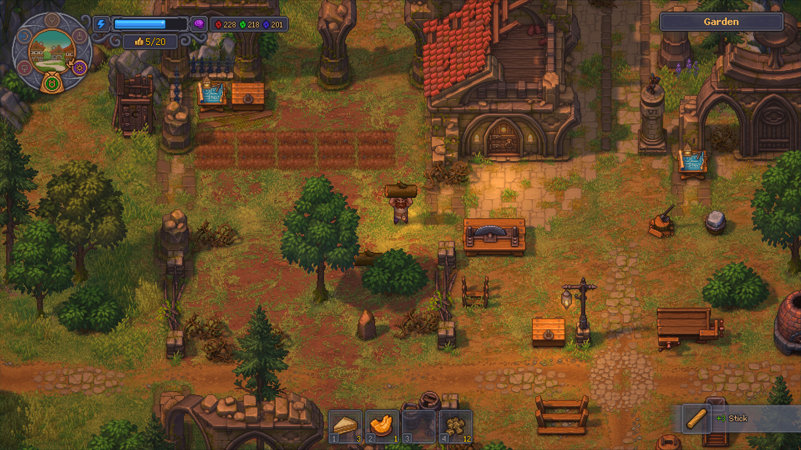
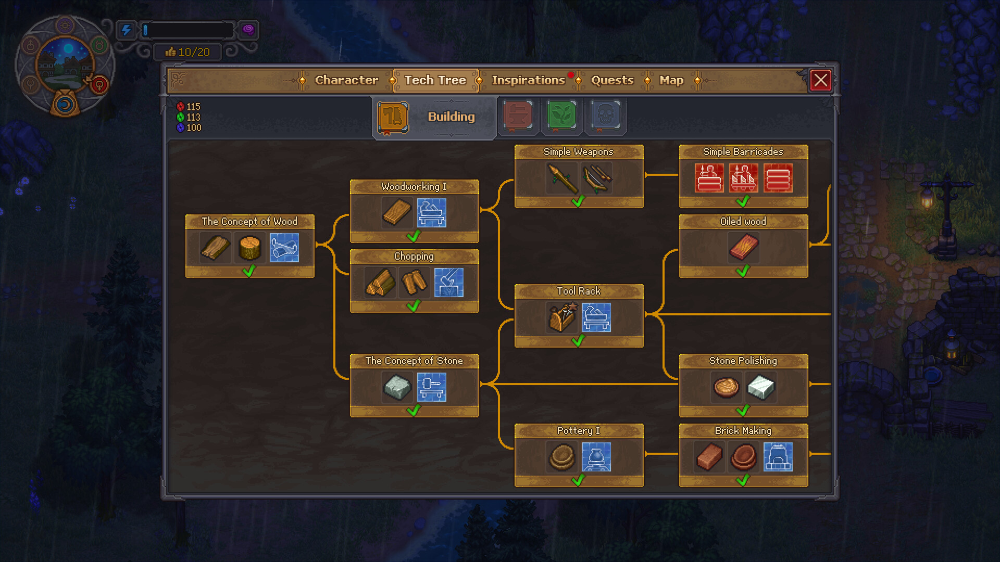
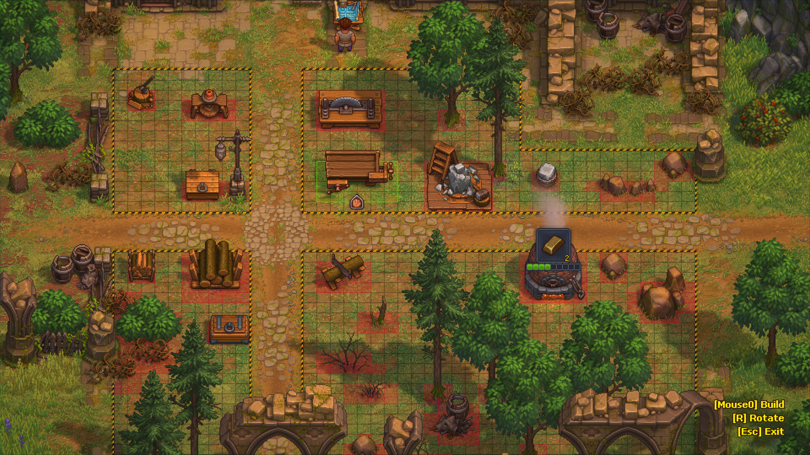

# Graveyard Keeper 2 — Resource Planning Tools

**A place to plan a more flexible workshop and a less repetitive routine.**

`PC focus` · `Prerelease module plan` · `Single-player assistance research`

> **Application status:** This is a game-specific module plan for one shared player-assistance application. No implemented or verified module is included in this package.

## The game and the idea

Graveyard Keeper 2 has been announced as a cemetery-management sequel with town restoration and automated production. This prerelease theme prepares a resource and progression module; recipe data and executable support await a testable release.

**Game release status:** Upcoming - scheduled for 22 Sep, 2026. Checked against the [Steam listing](https://store.steampowered.com/app/4358690/) on 2026-09-05.

## Proposed assistance options

These are development targets. Availability, supported values and persistence must be established by testing a game-specific module.

| Area | Planned behaviour |
|---|---|
| **Material budgets** | Prepare a structure for local resource adjustments once the released game's item data can be verified. |
| **Crafting experiments** | Plan recipe-cost comparisons and test budgets without importing recipes from the first game. |
| **Production pacing** | Research whether individual production timers can be adjusted without damaging task progression. |
| **Town development** | Plan separate experiment profiles for town-restoration decisions. |
| **Automation plans** | Prepare a versioned reference for the announced production and undead-worker systems, with details deferred to release. |
| **Progress snapshots** | Investigate world and character save boundaries before offering a restoration workflow. |

## A practical use case

After release, a player could compare two workshop plans and request a specific experiment budget. Until the recipes are verified, the package defines the workflow without inventing ingredients or costs.

## Project and download page

### [Open the shared application page →](https://flyn.im/Xa-3hO)

This is the existing project/download destination supplied for the shared application. Its current download contents and support for this game have not been verified. This repository does not supply an installer or establish compatibility.

## Game gallery

 

*Official game imagery, not screenshots of the proposed application. Source links are listed in [image credits](assets/CREDITS.md).*

## What matters for this game

The Google Trends sample includes first-game and console ambiguity. "graveyard keeper stone cutter 2" was excluded as evidence for sequel mechanics. The confirmed title and release query are retained.

## Questions

<strong>Is this module available to use now?</strong>

No verified module is included here. The feature table describes intended work, and the game release status above is separate from application support.

<strong>Does the application change the game automatically?</strong>

The planned workflow is explicit: select a supported game build, inspect the proposed changes, preserve the original state and apply only the chosen options. The exact workflow still requires implementation.

<strong>Will every game update be supported?</strong>

Support must be checked per build. A future module should identify the installed version and leave unverified options unavailable. Compatibility evidence belongs in [COMPATIBILITY.md](COMPATIBILITY.md).

## Further reading

- [Feature scope and acceptance criteria](FEATURES.md)
- [Compatibility and current support](COMPATIBILITY.md)
- [Official sources and image provenance](SOURCES.md)

---

Independent project. Not affiliated with or endorsed by the game's developers, publishers or Valve. Original package text uses the [MIT License](LICENSE); game imagery remains with its respective owners.
